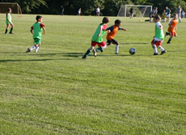
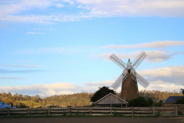
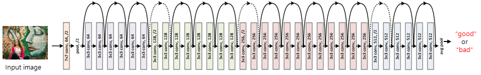

# Composition Classifier #
This project classifies whether an input image has good or bad composition using deep learning framework.

## Introduction ##
To create our dataset, we first downloaded various quality photos from [Flickr](www.flickr.com) and [DPChallenge](www.dpchallenge.com). We then generated the train dataset with the downloaded images using the [coupe.composition-score-calculator](https://github.com/posgraph/coupe.composition-score-calculator) project. The [coupe.composition-score-calculator](https://github.com/posgraph/coupe.composition-score-calculator) project calculates an input image’s composition score using matlab. Because the project uses matlab, it takes a while to get a composition score. To solve this problem, we use deep learning.  
  
We use a Residual Network [1](#references) for training the network. Our final model takes 18ms to test an input image.  

| ||
|:-------------:|:--------------:|
|Bad Composition|Good Composition|

## Files ##
  * main_lua: Training code
  * myIterator.lua: Set dataset path and augment dataset
  * network.lua: design a network architecture
  * classification_test.lua: Test code
    
## How to Use ##
* Test Function Usage  
```
th classification_test.lua –net model/baseline-epoch-9.net –dir  <your test_directory_path>
```
## Requirements ##
* Linux OS
* Torch7
  * Installation guide in [English](http://www.jetsonhacks.com/2015/05/20/torch-7-scientific-computer-framework-with-cudnn-nvidia-jetson-tk1/) and [Korean](http://www.whydsp.org/279)
* CUDA <= 7.5

## Neural Network Framework ##
We use a Residual network [1](#references) as our network structure. The Residual network can get high performance even though it has many layers. Commonly, deep neural networks have higher training error when it is deeper, but Residual networks add new architecture named shortcut connections so it can avoid the gradient vanishing problem.



## License ##
This software is being made available for research purpose only. Check [LICENSE](LICENSE) file for details.  

## Contact ##
Eunbin Hong (hong5827 [at] postech [dot] ac [dot] kr)

## About Coupe Project ##
Project ‘COUPE’ aims to develop software that evaluates and improves the quality of images and videos based on big visual data. To achieve the goal, we extract sharpness, color, composition features from images and develop technologies for restoring and improving by using it. In addition, personalization technology through user preference analysis is under study.  
  
Please checkout out other Coupe repositories in our [Posgraph](https://github.com/posgraph) github organization.

## Useful Links ##

  * [Coupe Library](http://coupe.postech.ac.kr/)
  * [POSTECH CG Lab.](http://cg.postech.ac.kr/)
  
## References ##
1. He, K., Zhang, X., Ren, S. and Sun, J. Deep residual learning for image recognition. In Proceedings of the IEEE CVPR (2016). 
